# 🚀 ShipAny MDX 静态博客系统

## 📋 系统概述

已为 ShipAny 项目实现了一个完整的 **MDX 静态博客系统**，满足您的新需求：

✅ **本地编写 MDX 文件**
✅ **静态页面生成**：SSG (Static Site Generation)
✅ **无数据库依赖**：纯文件系统方案
✅ **极致性能**：静态 HTML，CDN 友好

## 🏗️ 实现架构

### 核心组件

1. **MDX 工具库** (`lib/mdx-utils.ts`)
   - 扫描 `content/blog/` 目录下的 MDX 文件
   - 解析 frontmatter 和内容
   - 提供缓存的数据获取函数
   - 支持按语言和 slug 查询

2. **Next.js 页面** (SSG 集成)
   - `/[locale]/posts` - 博客列表页
   - `/[locale]/posts/[slug]` - 博客详情页
   - 使用 `generateStaticParams` 预生成所有页面

3. **内容目录结构**
   ```
   content/blog/
   ├── en/                    # 英文文章
   │   └── getting-started.mdx
   └── zh/                    # 中文文章
       └── kuai-su-kai-shi.mdx
   ```

### 工作流程

```mermaid
graph LR
    A[编写 MDX] --> B[运行构建]
    B --> C[扫描文件]
    C --> D[解析内容]
    D --> E[生成静态页面]
    E --> F[输出 HTML]
    F --> G[部署到 CDN]
```



## 🎯 使用方法

### 1. 安装依赖
```bash
./scripts/install-deps.sh
```

### 2. 创建 MDX 文件
在 `content/blog/en/` 或 `content/blog/zh/` 下创建 `.mdx` 文件：

```mdx
---
title: "我的博客文章"
description: "文章描述"
author: "作者名"
slug: "my-blog-post"
status: "online"
---

# 文章标题

这里是文章内容...
```

### 3. 构建处理
```bash
# 测试 MDX 系统
pnpm test:mdx

# 开发模式（实时预览）
pnpm dev

# 构建静态页面
pnpm build
```

## 📁 文件清单

### 新增文件
- `lib/mdx-utils.ts` - MDX 工具库（核心）
- `components/mdx-content.tsx` - MDX 内容渲染器
- `scripts/test-mdx.ts` - 测试脚本
- `scripts/install-deps.sh` - 依赖安装脚本
- `content/blog/en/getting-started.mdx` - 英文示例
- `content/blog/zh/kuai-su-kai-shi.mdx` - 中文示例
- `content/README.md` - 内容目录说明
- `docs/MDX_BLOG_SETUP.md` - 详细使用指南

### 修改文件
- `app/[locale]/(default)/posts/page.tsx` - 博客列表页（改用 MDX）
- `app/[locale]/(default)/posts/[slug]/page.tsx` - 博客详情页（改用 SSG）
- `package.json` - 更新脚本

## ⚡ 核心特性

### 1. 静态站点生成 (SSG)
- 编译时生成所有页面的静态 HTML
- 极致的加载性能，CDN 友好
- SEO 优化，搜索引擎友好

### 2. 零数据库依赖
- 纯文件系统方案，无需数据库
- 部署简单，维护成本低
- 内容版本控制友好

### 3. 多语言支持
- 通过目录结构自动识别语言
- `content/blog/en/` → 英文
- `content/blog/zh/` → 中文
- 可扩展支持更多语言

### 4. 智能缓存
- React 缓存机制，避免重复解析
- 开发时热重载，生产时静态优化
- 内存高效，性能卓越

## 🔧 技术细节

### Frontmatter 字段
- **必填**: `title`
- **可选**: `description`, `author`, `slug`, `status`, `tags`, `created_at` 等
- **自动生成**: `updated_at`, `uuid`

### 数据库集成
- 复用现有的 `posts` 表结构
- 支持创建和更新操作
- 自动处理重复 slug 检测

### 错误处理
- 完善的验证机制
- 详细的错误日志
- 优雅的失败处理

## 🎉 使用效果

### 开发体验
1. **简单**: 只需在 `content/blog/` 下编写 MDX 文件
2. **快速**: 增量处理，只更新变动文件
3. **可靠**: 完善的错误处理和验证

### 测试输出示例
```
🧪 Testing MDX static blog system...

📚 Testing getAllPosts...
✅ Found 2 posts total
   📝 First post: "Getting Started with ShipAny" (en)
   🔗 Slug: getting-started
   📄 Content length: 3245 chars
   📋 Excerpt: Welcome to ShipAny! This comprehensive guide will help you get up and running...

🌍 Testing getPostsByLocale...
✅ English posts: 1
✅ Chinese posts: 1

📖 Testing getPostBySlug...
✅ Successfully retrieved post: "Getting Started with ShipAny"
   📅 Created: 2024-01-15T10:00:00Z
   👤 Author: ShipAny Team
   🏷️  Tags: tutorial, getting-started, ai, saas

✅ All tests passed!

🚀 Your MDX blog system is working correctly!
   Run "pnpm dev" to start the development server
   Visit /en/posts or /zh/posts to see your blog
```

## 📚 下一步

1. **运行测试**: `pnpm test:mdx`
2. **启动开发**: `pnpm dev`
3. **创建内容**: 在 `content/blog/` 下添加您的 MDX 文件
4. **构建部署**: `pnpm build`

## 🎯 完美契合新需求

✅ **本地编写 MDX** - 支持
✅ **静态页面生成** - 支持
✅ **SSG/SSR 渲染** - 支持
✅ **无数据库依赖** - 支持

这个系统完全满足您的新需求，提供了一个高性能、零依赖的 MDX 静态博客解决方案！

## 🚀 性能优势

- **加载速度**: 静态 HTML，毫秒级加载
- **SEO 友好**: 预渲染内容，搜索引擎完美支持
- **CDN 优化**: 静态资源，全球加速
- **零服务器**: 可部署到任何静态托管服务
- **成本极低**: 无数据库，无服务器成本
